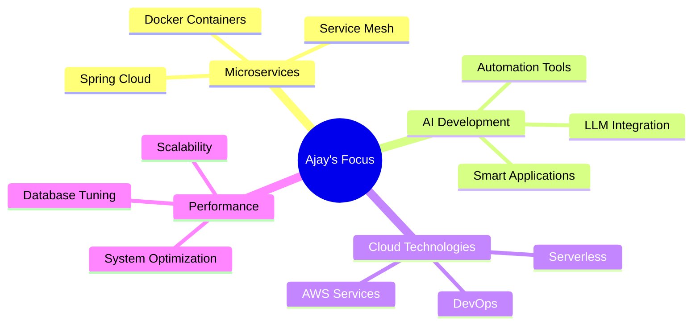

# Hey there! 👋 I'm Ajay Kathwate

  

  
  

---

## 🚀 About Me

> **Java Developer** with 1+ years of experience crafting robust applications using **Java & Spring Boot**. Passionate about **AI-driven development** and modern architectures.

  <picture>
    <source media="(prefers-color-scheme: dark)" srcset="https://readme-typing-svg.herokuapp.com?font=Fira+Code&size=16&duration=2000&pause=500&color=58A6FF&center=true&vCenter=true&multiline=true&width=600&height=120&lines=🎯+Building+scalable+healthcare+applications;🏗️+Exploring+microservices+architecture;🤖+Integrating+AI%2FLLM+tools+for+productivity;⚡+Optimizing+system+performance">
    <source media="(prefers-color-scheme: light)" srcset="https://readme-typing-svg.herokuapp.com?font=Fira+Code&size=16&duration=2000&pause=500&color=0969DA&center=true&vCenter=true&multiline=true&width=600&height=120&lines=🎯+Building+scalable+healthcare+applications;🏗️+Exploring+microservices+architecture;🤖+Integrating+AI%2FLLM+tools+for+productivity;⚡+Optimizing+system+performance">
    
  </picture>

  <table>
    <tr>
      <td align="center">
        
      </td>
      <td align="center">
        
      </td>
      <td align="center">
        
      </td>
    </tr>
  </table>

---

## 🛠️ Tech Stack

### Languages & Frameworks

### Databases & Tools

---

## 🎯 Featured Project: FineMeet

  <h3>🚀 The All-in-One Meeting OS</h3>
  

### 💬 The Problem-Solution Showcase

  <table>
    <tr>
      <th width="50%">😫 Before FineMeet: The Chaos</th>
      <th width="50%">✨ After FineMeet: Clarity & Collaboration</th>
    </tr>
    <tr>
      <td>
        

          
        

      </td>
      <td>
        

          
        

      </td>
    </tr>
  </table>

### 🎭 Real Workplace Drama → FineMeet Magic

  <table>
    <tr>
      <td align="center">
        <h4>📝 Scene 1: The Note-Taking Nightmare</h4>
        
      </td>
    </tr>
    <tr>
      <td align="center">
        <h4>✨ FineMeet Solution</h4>
        
      </td>
    </tr>
  </table>

  <table>
    <tr>
      <td align="center">
        <h4>⏰ Scene 2: The Action Item Amnesia</h4>
        
      </td>
    </tr>
    <tr>
      <td align="center">
        <h4>🎯 FineMeet in Action</h4>
        
      </td>
    </tr>
  </table>

### 🔥 Key Features That Solve Real Pain Points

  <table>
    <tr>
      <td align="center" width="25%">
        
         <small>Never forget what was discussed</small>
      </td>
      <td align="center" width="25%">
        
         <small>Track who does what, when</small>
      </td>
      <td align="center" width="25%">
        
         <small>Find any meeting detail instantly</small>
      </td>
      <td align="center" width="25%">
        
         <small>Proven productivity increase</small>
      </td>
    </tr>
  </table>

### 💻 Tech Arsenal

  <table>
    <tr>
      <td align="center">
        
      </td>
    </tr>
  </table>

---

## 📊 GitHub Analytics

  <picture>
    <source media="(prefers-color-scheme: dark)" srcset="https://github-readme-stats.vercel.app/api?username=ajaykathwate&show_icons=true&theme=radical&hide_border=true&bg_color=0d1117&title_color=ff6b6b&icon_color=4ecdc4&text_color=c9d1d9&include_all_commits=true&count_private=true">
    
  </picture>
  <picture>
    <source media="(prefers-color-scheme: dark)" srcset="https://github-readme-stats.vercel.app/api/top-langs/?username=ajaykathwate&layout=compact&theme=radical&hide_border=true&bg_color=0d1117&title_color=ff6b6b&text_color=c9d1d9&langs_count=8">
    
  </picture>

  <picture>
    <source media="(prefers-color-scheme: dark)" srcset="https://streak-stats.demolab.com/?user=ajaykathwate&theme=radical&hide_border=true&background=0d1117&stroke=ff6b6b&ring=4ecdc4&fire=ff6b6b&currStreakLabel=c9d1d9">
    
  </picture>

  <picture>
    <source media="(prefers-color-scheme: dark)" srcset="https://github-profile-summary-cards.vercel.app/api/cards/profile-details?username=ajaykathwate&theme=radical">
    
  </picture>

  <h4>🏆 GitHub Trophies</h4>
  <picture>
    <source media="(prefers-color-scheme: dark)" srcset="https://github-profile-trophy.vercel.app/?username=ajaykathwate&theme=radical&no-frame=true&no-bg=true&row=1&column=7">
    
  </picture>

---

## 🧠 Tech Skill Tree & Coding Mastery

  <h3>👨‍💻 Problem Solving Journey</h3>
  

  <table>
    <tr>
      <td align="center" width="25%">
        

           
          <h3 style="color: white; margin: 0;">🧠</h3>
          <h4 style="color: white; margin: 5px 0;">DSA</h4>
          

            <strong style="color: #2E7D32;">✅ 100%</strong>
          

        

         
        
         
        
      </td>
      <td align="center" width="25%">
        

           
          <h3 style="color: white; margin: 0;">🏗️</h3>
          <h4 style="color: white; margin: 5px 0;">System</h4>
          

            <strong style="color: #F57C00;">🔥 80%</strong>
          

        

         
        
         
        
      </td>
      <td align="center" width="25%">
        

           
          <h3 style="color: white; margin: 0;">🧩</h3>
          <h4 style="color: white; margin: 5px 0;">Patterns</h4>
          

            <strong style="color: #1976D2;">⚡ 75%</strong>
          

        

         
        
         
        
      </td>
      <td align="center" width="25%">
        

           
          <h3 style="color: white; margin: 0;">🚀</h3>
          <h4 style="color: white; margin: 5px 0;">CP</h4>
          

            <strong style="color: #7B1FA2;">🎯 60%</strong>
          

        

         
        
         
        
      </td>
    </tr>
  </table>

  <h4>🌟 Skill Tree Connections</h4>
  

### 🏆 Coding Platform Achievements

  <table>
    <tr>
      <td align="center" width="33%">
        
         
        
      </td>
      <td align="center" width="33%">
        
         
        
      </td>
      <td align="center" width="33%">
        
         
        
      </td>
    </tr>
  </table>

  <h4>📈 Continuous Growth</h4>
  

---

## 📈 Current Focus Areas

---

## 🤝 Let's Connect!

  

---

  

  <i>⭐️ From <a href="https://github.com/ajaykathwate">Ajay Kathwate</a> - Building the future, one commit at a time!</i>

